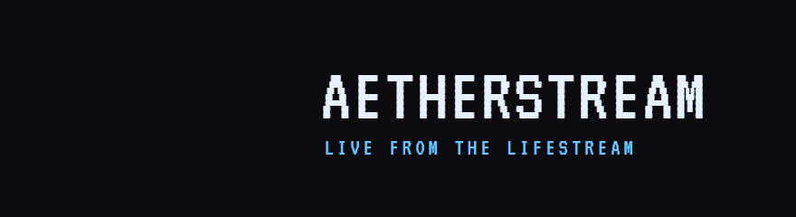

<p align="center"></p>

# Aetherstream

**[aetherstream.corkedfever.com](https://aetherstream.corkedfever.com/)** — install and how-to, on one page.

A television in Final Fantasy XIV. Live streams, your Plex library and thousands of live TV channels,
painted **onto a real in-game furnishing** so the game lights and occludes the picture like anything
else in the room — and party groups so a few friends can watch the same thing together.

## Installing

1. In Dalamud settings → *Experimental* → *Custom Plugin Repositories*, add
   `https://raw.githubusercontent.com/CorkedFever/Aetherstream/main/repo.json` and save.
2. Open the plugin installer, search for **Aetherstream**, install it.
3. `/aether` opens the window.

### What it needs

| To do this | You need | Notes |
| --- | --- | --- |
| Twitch, Plex, live TV, direct stream URLs | nothing | works out of the box |
| **YouTube**, Kick and most other sites | **yt-dlp** | `winget install --id yt-dlp.yt-dlp --exact` in a terminal, then **restart the game** — it reads `PATH` when it starts, so an install made while it is running is invisible until you relaunch. If YouTube stops working later, `yt-dlp -U` is the first thing to try. |
| **YouTube** in particular | **Deno** (a JavaScript runtime) | `winget install --id DenoLand.Deno --exact`, then restart the game. yt-dlp needs it to solve YouTube's challenges; without it YouTube half-works at best. |
| Broadcasting to a party | **ffmpeg** on `PATH` | `winget install --id Gyan.FFmpeg --exact`. Watching a party needs nothing. |

If a YouTube link does nothing, the screen says why: `NO PICTURE — yt-dlp is not installed…`.

### First five minutes

- **Screen tab → Known screens → Everkeep Monitor.** Stand next to your monitor and click it; the
  picture lands on the nearest one. Recolour the wall behind it black in-game — the panel is an
  additive effect, and a black wall is the single biggest quality win.
- **Live TV.** Right-click a channel to give it a number; channel ▲/▼ and last-channel on the remote
  step through those. Plenty of channels in a public list are dead at any given moment — if one does
  nothing, try another. Add your own list (an ErsatzTV or Tunarr server, say) from the playlist
  picker.
- **Share.** The plugin is signed in to the Aetherstream party server out of the box. Make a party,
  send the six-character code. Whoever pastes it into the Watch tab sees what you broadcast.

## Dependencies

Everything third-party, what it is for, and where it comes from. **Bundled** ships in the release
zip; **external** has to be on the user's machine; **server** runs on the party host only.

### Bundled with the plugin

| Dependency | Version | Licence | Used for |
| --- | --- | --- | --- |
| [libvlc](https://www.videolan.org/vlc/libvlc.html) (`VideoLAN.LibVLC.Windows`) | 3.0.21 | LGPL 2.1+ (some plugins GPL) | All decoding: HLS, DASH, RTMP, files, every codec. This is ~90 MB of the zip and the reason it is that size. |
| [LibVLCSharp](https://github.com/videolan/libvlcsharp) | 3.9.4 | LGPL 2.1 | .NET bindings to libvlc — the video and audio callbacks the framebuffer comes through. |
| [NAudio](https://github.com/naudio/NAudio) / `NAudio.Wasapi` | 2.2.1 / 2.3.0 | MIT | Audio output. Dalamud has no audio API, so the plugin opens its own shared-mode WASAPI render stream. |
| [VT323](https://fonts.google.com/specimen/VT323) | Google Fonts, 2011 | SIL OFL 1.1 | The display face — headings, the on-screen display, the input strip. `Fonts\OFL.txt` ships beside it, as the licence requires. |
| [ImageSharp](https://github.com/SixLabors/ImageSharp) 3.1 | Six Labors | Six Labors Split License (Apache 2.0 terms for open source) | Decodes venue banners, which are WebP, into pixels for the venues channel. |
| Bossa Antigua, Lobby Time, Backbay Lounge, Airport Lounge, Deuces | [Kevin MacLeod](https://incompetech.com), incompetech.com | CC BY 4.0 | The music under the guide and weather channels, re-encoded at 112 kbps. `music\CREDITS.txt` ships beside them; the Sound tab can swap in your own folder or a Plex playlist. |
| [Dalamud](https://github.com/goatcorp/Dalamud) (`Dalamud.NET.Sdk`) | 15.0.0 / API level 15 | AGPL 3.0 | The plugin host: ImGui, textures, the game object table, logging. Not in the zip — every user already has it. |

libvlc's own plugin set is shipped unpruned. It is the safest choice — pruning it is what produced
the "no Opus decoder" theory that turned out to be wrong — at the cost of the download.

### External — on the user's machine

| Dependency | Needed for | Install | Licence |
| --- | --- | --- | --- |
| [yt-dlp](https://github.com/yt-dlp/yt-dlp) | YouTube, Kick and most other sites | `winget install --id yt-dlp.yt-dlp --exact`, then restart the game | Unlicense |
| [Deno](https://deno.com/) | **YouTube specifically** — yt-dlp solves YouTube's JavaScript challenges with an external runtime, and without one it warns, drops its preferred formats and hands back what is left | `winget install --id DenoLand.Deno --exact`, then restart the game | MIT |
| [ffmpeg](https://ffmpeg.org/) | Broadcasting to a party (not watching one) | `winget install --id Gyan.FFmpeg --exact` | LGPL 2.1+ / GPL 2+ depending on build |

Both are looked up on `PATH` at the moment they are needed. yt-dlp is also found in the plugin's
config folder, or wherever the **Setup tab**'s file picker is pointed — so a copy downloaded by
hand to the Desktop works, once, for good. (Not beside the plugin DLL: Dalamud installs each version into its
own numbered folder, so anything left there vanishes on the next update.) Neither is downloaded by the plugin, deliberately —
a plugin that fetches executables is not something to ask people to trust.

### Data sources

| Source | What | Notes |
| --- | --- | --- |
| [iptv-org](https://github.com/iptv-org/iptv) | The default live TV playlist (`index.m3u`) | Volunteer-maintained index of publicly available streams. Cached locally for 12 hours; any other extended M3U can be used instead or alongside it. |
| [Plex](https://www.plex.tv/) | Your own library, via `plex.tv/link` sign-in | The token is stored locally and only ever sent to your own server. |
| [Carbuncle Plushy fish tracker](https://github.com/icykoneko/ff14-fish-tracker-app) | The fishing channel's windows: weather, preceding weather, hours, bait | MIT, by icykoneko. Trimmed to the fish with a window by `tools/make_fishdata.py` and bundled as `data/fish.json.gz`; nothing is fetched at run time. |

### Server — the party host only

Lives in `deploy\`; nothing here runs on a viewer's machine.

| Dependency | Version | Licence | Role |
| --- | --- | --- | --- |
| [MediaMTX](https://github.com/bluenviron/mediamtx) | `bluenviron/mediamtx` (Docker) | MIT | Takes the host's SRT push and serves it as HLS. Publish authorisation is delegated to the party service. |
| [Caddy](https://caddyserver.com/) | on the host | Apache 2.0 | TLS and routing. Serves HLS on an **HTTP/1.1-only** listener — libvlc 3 cannot fetch HLS over HTTP/2. |
| Party service | `python:3.12-alpine` (Docker), standard library only | — | Groups, codes, membership, and the MediaMTX auth callback. No third-party Python packages. |

## Layout

| Project | Depends on | Purpose |
| --- | --- | --- |
| `Aetherstream.Core` | nothing | The contracts: `IFrameSource`, `FramePipeline`, `StereoRingBuffer`, `IStreamResolver`. Copied from Memoria where noted — keep them byte-compatible. |
| `Aetherstream.Playback` | Core, LibVLCSharp | Decode, resolution, the M3U parser, the HLS relay, known screens. **No UI dependencies.** |
| `Aetherstream.PoC` | Core, Playback, NAudio | Throwaway WinForms harness. Its GDI blit exists only to prove pixels flow through our buffer. |
| `Aetherstream.Plugin` | Core, Playback, NAudio | The Dalamud plugin: overlay panel, surface painting, audio. |

## The window

The window is a television: the live picture in a bezel at the top, a remote under it, a strip of
inputs, and whichever input is selected filling the rest. The screen and remote sit outside the
inputs deliberately — pausing should never mean navigating away from what you were doing, and the
picture is the one thing worth seeing from every panel. It is built to sit beside Memoria and read
as its sibling: the same near-black shell, the same rule that the display face (VT323, SIL OFL,
shipped in `Fonts\`) is for short labels only, never for a path or an error.

| File | Holds |
| --- | --- |
| `UI\Theme.cs` | The palette, the shell styling, the glass panel, the display font. Every colour decision lives here. |
| `UI\Ui.cs` | Shared widgets; its colour names forward to `Theme` so older panels keep working. |
| `UI\DisplayFont.cs` | VT323 at 20 px and 40 px. The face is drawn on a 20-pixel grid and only looks right at multiples of it. |
| `UI\ControlWindow.cs` | The shell: hand-drawn title bar, folding, the input strip. Pushes the theme in `PreDraw`, pops it in `PostDraw`, and catches everything in `Draw` so a throw cannot leave the style stack unbalanced for every other plugin's window. |
| `UI\Screen.cs` | The picture, the on-screen display, the scrub strip, the signal states, the LED. |
| `UI\Remote.cs` | Transport, channel up/down, last channel, mute. |
| `UI\ChannelDial.cs` | Channel numbers (pin order), stepping, last-channel memory, which channels are known dead. |
| `UI\UiContext.cs` | What every panel needs, so a panel's constructor stays one argument long. |
| `UI\PosterCard.cs` | One clickable tile, drawn by hand so the whole tile is the hit target. |
| `UI\PlexArt.cs` | Poster and logo textures, fetched once and kept. |
| `UI\Tabs\*.cs` | Watch, Library, Live TV, Screen, Sound, Share, Setup. |

Two things worth knowing before editing it:

- **Poster textures are ours; the video texture is not.** Nothing outside our own draw lists ever
  sees a poster, so unlike the video texture they can be released — but only after a frame delay
  (`PlexArt.RetireFrames`), because a draw list built this frame is submitted after `Draw` returns.
- **Wrapping a row of chips needs `GetItemRectMax().X`, not `GetCursorPosX()`.** After a button the
  cursor has already moved to the next line, so it cannot answer "does the next one still fit".

## Painting on a real surface

The overlay panel is drawn in ImGui after the game has finished its frame, so it has no depth: it
paints over walls and over your character, and nothing can fix that from where it draws. Painting on
a surface hands our texture to the game's own renderer instead, and everything works because the
game does not know or care that the texture is video.

Two kinds of surface, found in different places:

- **Model materials.** A furnishing's model → `ModelResourceHandle` → material handles → texture
  handles → `Kernel.Texture`. Swap its `D3D11ShaderResourceView`.
- **Effect (VFX) textures.** Some furnishings draw their screen as an effect, not a surface — the
  Everkeep Monitor's only model is its *base*. Those sample `.atex` textures, located by walking
  every loaded resource (`ResourceManager.ResourceGraph`) and matching on the furnishing's number.
  `ApricotTextureResourceHandle` ends at the same `Kernel.Texture`, so the swap is identical.

### Effects blend additively — put a black wall behind them

An additively blended panel computes *background + picture*, so whatever is behind it is added into
the image: a patterned wall washes the picture out, and no amount of alpha fixes it because alpha is
not what is being honoured. **Recolour the actual in-game wall behind the screen to black** and it
contributes zero, so the picture reads almost true. This is the single biggest quality win for a
VFX-based screen, and it is done in the game, not in code.

Also available for effects: the `Fit` sliders (a VFX panel often fades out toward its edges — shrink
the picture into the solid region), `Brightness`, and painting a second texture flat white as a mask.

## Things that will bite you again

- **Never free a GPU object the game has ever seen.** Every crash this produced was a game material
  still pointing at a view whose last reference we had dropped, faulting inside `nvwgf2umx.dll` on a
  driver thread with none of our frames on the stack. `SurfaceBinding` tracks every painted slot and
  **never releases** its reference; textures and the LibVLC instance are deliberately leaked on
  unload. Leaked megabytes beat a crash to desktop.
- **Furniture is not in `ActiveLayout`.** That holds the building (`bg/…/bgparts`). Furnishings live
  in the *other* loaded layouts (`LayoutWorld.LoadedLayouts`), as **shared groups** whose children
  hold the models — a container has no graphics of its own, so filtering on "has graphics" discards
  every furnishing in the room.
- **A furnishing's object-table entry has no draw object.** It is a targeting proxy; the renderable
  instance is the layout's, linked by `HousingObject.LayoutId`.
- **`ImGui.EndChild()` must be called unconditionally**, even when `BeginChild` returns false.
  Skipping it unbalances ImGui's stack and produces malformed draw data — which the GPU driver
  faults on, looking exactly like a graphics bug.
- **Validate every game pointer before dereferencing** (`SafeMemory`, via `VirtualQuery`). Arrays
  like `ModelResourceHandle.MaterialResourceHandles` carry no count.
- **Never read a field twice when a background task replaces it.** `if (items.Count > 0) … items[0]`
  counts one list and indexes another if a Plex listing lands between the two reads. Snapshot the
  reference into a local and use that for the whole method. The same shape — checking state, then
  mutating it, then reading it again — is what crashed the breadcrumb: `GoUp()` emptied the trail
  and the next line indexed it, with the guard one line too late.
- **State that Draw reads is replaced, not edited in place.** `trail.Clear()` from a worker thread
  while the render thread walks it is a crash waiting for a slow server. Assigning a fresh list is
  atomic; the reader keeps the old one for the rest of its frame.
- **A cache budget must count exactly what it is budgeting.** Gating on total entries while
  evicting only *loaded* ones let a few hundred failed fetches ask for more evictions than there
  were textures — throwing out every poster on screen and refetching them, every frame, forever.
- **`ImGui.IsItemHovered()` is false for anything inside `BeginDisabled`.** So the tooltips that
  explain why a control is greyed out are precisely the ones that never appear. Pass
  `ImGuiHoveredFlags.AllowWhenDisabled`.

## Releasing

```
./release.sh 0.2.10 --notes notes.md
```

One command, and it refuses to cut a release from anything but a clean, pushed `main`. It bumps the
version in the `.csproj`, the plugin manifest and both `repo.json` copies; builds with the exit code
checked directly; packages `bin\Debug` flat (`Aetherstream.dll` and `Aetherstream.json` at the root,
`Fonts\`, `images\` and `libvlc\` beside them) into a zip *outside* the tree; asserts the version,
author and icon inside that zip; commits, tags, pushes and publishes the release; then updates the
mirrors and tells GitHub Pages to build, waiting until the fallback copy actually serves the new
version. `--dry-run` does everything up to the commit and puts the bumps back.

Every step is there because its absence once shipped something wrong. Piping `dotnet build` into
`grep` masked a failed compile and shipped the previous binaries under a new version; a zip in the
working tree ended up in history; Pages twice stopped building on its own and the fallback mirror
fell three releases behind. The dev-plugin folder gets the fresh build too (`--no-dev` to skip), so
"testing a stale build" cannot happen either.

The first install on another machine (2026-08-30) confirmed the flat zip layout works with
`Core.Initialize` resolving `libvlc\win-x64` relative to `AssemblyLocation`; the fiddling that day
was `raw.githubusercontent.com` failing on that machine, which is why the manifest is mirrored.

## Live TV, and why channels used to die at twenty seconds

Channels come from any extended M3U (`M3uPlaylist`); `#EXTVLCOPT:` lines are literally libvlc
options, and the user agent and referrer they carry travel on `ResolvedStream.HttpHeaders` — several
hundred channels in the public list refuse to serve without them, which is why a channel is started
directly rather than sent back through the resolver chain as a bare string.

Some portals answer their advertised URL with a redirect to a tokenised playlist that is valid for
a few seconds. libvlc resolves the redirect once and refreshes the tokenised URL forever, so the
first refresh — and every one after — gets HTTP 509. It plays out the segments it has and stops,
about twenty seconds in. Plain VLC does the same. `HlsRelay` is a loopback HTTP server that
re-resolves the original URL behind a stable address, renames segments by media sequence and
proxies the bytes; the decoder never sees a token. It is used automatically, once, when a relayable
stream stalls. Three things it had to get right that a first draft did not:

- `HttpClient` refuses to auto-follow an HTTPS→HTTP redirect, and that downgrade is exactly what
  these portals do. Redirects are followed by hand.
- The client *does* auto-follow same-scheme hops, so the final address must come from
  `response.RequestMessage.RequestUri`, not from the loop's own bookkeeping — or every segment path
  resolves against the wrong host and the origin answers 403.
- `#EXT-X-KEY` and `#EXT-X-MAP` URIs live on the same expiring host and must be proxied too.

It speaks HTTP over a raw socket rather than `HttpListener`, which on Windows needs an
administrative URL reservation — not something to ask of someone installing a plugin.

**Stall detection had never fired** before this: it accepted progress from position as well as
delivered audio, and libvlc's clock keeps running on a starved live stream. Delivered audio is the
authority whenever there is an audio track. libvlc's own log is now forwarded at warning and above
(`Plugin.VlcLog.cs`), rate-limited and with the routine start-up messages filtered, so the next
stream failure names itself instead of being reproduced in a desktop harness.

## The guide channel

The list button on the remote puts up a listings channel in the style of the 90s TV Guide
Channel: whatever is playing shrinks into the top-left corner, the time and what is on sit
beside it, and a grid of everything you could be watching scrolls up underneath on its own —
pinned channels by number, live parties, then recent films and videos. Channel up and down
still work while it is up, and the current row is highlighted. With nothing playing the test
card takes the corner.

It is drawn straight into the frame buffer, so it shows in the window and on a painted
furnishing alike and costs nothing while it is off. The text comes from `images/guidefont.a8.gz`,
VT323 rasterised at build time by `tools/make_guidefont.py` (needs Pillow); re-run that after
changing the size in the script. Glyphs are ASCII only — names are folded to plain letters
before drawing.

## The weather channel

The cloud button beside the guide puts up Local on the 8s for Eorzea: the zone you are standing
in, what the sky is doing and when it changes, the next five weather periods, and a crawl of
every outdoor zone underneath. Indoors, the district you are in stands in for the sky.

Nothing is fetched. Eorzea's weather is a function of the clock — every 1400 real seconds a
number from 0 to 99 is drawn from the time and looked up in the zone's odds table — and both
the tables and the zone list are read from the game's own data through Dalamud, so a new
expansion's zones appear on their own. The maths lives in `Weather/EorzeaWeather.cs`; the icons
are 16x16 pixel art in `Video/WeatherChannel.cs`.

## Dead channels

Public playlists are full of channels that no longer answer, or answer with a black picture.
Two things find them. A link check asks each lineup channel for its headers in the background,
four at a time, once per lineup per session or from the "Check the lineup's links" button in
Setup, and marks the ones that fail. While a channel plays, the session samples the picture's
brightness once a second; black for fifteen seconds with frames still arriving marks it too, as
does a stall nothing could fix. Marks last a day, survive restarts, and clear themselves when a
channel plays properly. The guide, the lineup and channel up and down skip marked channels;
pinned ones stay on the guide reading OFF AIR. "Forgive them" in Setup clears the list.

## The other channels

The Channels tab is a dial of everything the set can draw for itself. Each is one class
implementing `IFrameChannel` in `Video\`, handed a snapshot by the plugin when it needs data:

| Channel | What it shows | Where the data comes from |
| --- | --- | --- |
| Guide | The listings grid, picture in the corner: the numbered lineup (pins, then the country and group chosen in Setup, defaulting to the character's region), what is playing and what is queued laid on the timeline from their lengths, live channels' programmes from XMLTV guides, recents with where you left off | The playlist's own guide plus the region's community guides (epgshare), or a URL set per playlist in the Live TV tab; cached twice a day and parsed for the lineup's first forty channels, matched by id then by name |
| Weather | Local on the 8s, with rare-weather and special alerts | The game's weather tables; the live sky via ClientStructs |
| Clock | Eorzea time, the calendar date, the moon, the sun's arc | The clock |
| News | Lodestone headlines, one story at a time, maintenance windows in local time with a countdown | lodestonenews.com, every fifteen minutes, cached in the config folder |
| Market | The watch list (kept in Setup) priced, a chart of the featured item, a ticker | Universalis, every ten minutes, for the world you are on |
| Gathering | Timed nodes as a departures board: up now, then soonest, with real-time countdowns | The game's gathering tables and the clock |
| Fishing | The fish you still need that have a window: up now with time left, then the soonest to open, each with spot, zone, weather and hours, bait or intuition; folklore fish in gold, your current zone marked; the next four boats along the top | Windows from the Carbuncle Plushy fish tracker's data (MIT), bundled; spots and zones from the game's tables, the forecast from the weather code, your log through ClientStructs. Caught fish hidden unless Setup says otherwise |
| Venues | Who is open in your region tonight (every datacenter of it) and who opens within a day, one venue featured with its banner and description, a crawl of everyone open | ffxivvenues.com's public API, every ten minutes, filtered to your region by the game's datacenter table; banners decoded with ImageSharp. SFW only by default, toggled in Setup |
| Almanac | Daily, Grand Company and weekly resets, the next ocean fishing boat and both routes' destinations, the Jumbo Cactpot draw for your region, retainers out on ventures; the right column turns pages between today's roulettes, a to-do list (leve and allied society allowances, custom deliveries, Wondrous Tails, the squadron, Fashion Report) and the estate's submersibles and airships | The clock; the rest through ClientStructs. Vessels are read while you stand in the workshop and remembered after |
| Horoscope | A Sharlayan reading a day for those born under your guardian: the arcana drawn (the six, with the meanings the astrologians give them), the moon in and whose it is, the sect by the Eorzean hour, a line each for the deity, the arcana, the moon and the sect, and a piece of counsel; a lucky number and the deity's colour | The guardian from the player state, or one chosen in Setup; the calendar from the clock; the lines are written in the setting's own vocabulary and seeded by the day and the deity, so everyone under one god reads the same card |
| Kitchen | A cooking show on a set: tiled wall, a window on the real sky, shelves, a counter with a board, a stove and a plate stand, and a Namazu chef who walks between them. Every episode a real Culinarian recipe: titles, the mise en place laid along the counter, each ingredient chopped in close-up and tossed into the pot, the pot stirred and steaming through the method, the dish plated, a hand-off to the next episode with credits. Hard cuts between wide and close-up, lower-thirds for the patter, an audience that reacts, a LIVE bug | The Recipe and Item tables and the game's icon textures through Lumina; crystals left off; the patter is written; the schedule runs from the wall clock so everyone sees the same episode |
| Scrambled | Channel 99: whatever is on, torn sideways in rolling bands with the colour smeared and the odd frame of static, easing for a moment every nine seconds so you almost make it out; every half minute a blue slate asks you to contact your cable operator | Procedural, over the current picture or the test card. There is nothing under it that was not already on |
| Aquarium, Fireplace, Starfield, Plasma, Mystify, 3D Maze, Pipes | Something on, nothing to read | Procedural; the heavy ones draw at a quarter size and scale up. The maze is a raycaster with the smileys that flip the world and the rat; Pipes is a 3D grid drawn back to front, teapot included |

The weather channel's alerts come in two kinds. Rare weather — a one-in-ten chance or less for
that zone — is scanned across every outdoor zone for the next six periods and shown on the
"Coming up" line, which is what fishers wait on. A special alert turns the header red when the
sky where you stand differs from what the tables say it should be: that only happens when the
game forces it, which is a FATE boss bringing its own weather — Tension over the Shroud is Odin,
Royal Levin in the Forelands is Coeurlregina, Quicklevin in the Lochs is Ixion, Hyperelectricity
in Azys Lla is Proto Ultima. It has to be seen from that zone; a set in a housing ward cannot
know what the Shroud's sky is doing.

## Channel music

The guide and the weather play music underneath, the way the real ones did. The Sound tab's
"Channel music" section picks the source: the bundled tracks (five Kevin MacLeod lounge pieces,
CC BY 4.0, in `music\`), a folder of your own (mp3, flac, ogg, m4a, wav, opus, subfolders
included), or an audio playlist on the Plex server you are signed in to. It is shuffled, looped,
placed in the room like the picture's own sound. The weather covers the picture, so it takes the
sound too; the guide keeps the picture in its corner, so a film playing keeps its own sound and the
music only fills in when nothing is on. `Playback\Jukebox.cs` is the second, audio-only decoder that plays it.

## Running the harness

```
Aetherstream.PoC.exe <url-or-twitch-channel> [flags]
```

| Flag | Effect |
| --- | --- |
| *(none)* | Video only. Audio is muted by default — see below. |
| `--audio` | Enable audio through the callback → ring → WASAPI path. |
| `--probe-audio` | Run the full decode and ring path with **no output device**, so the audio diagnostics can be read without anything reaching the speakers. |
| `--vlc-audio` | Let libvlc own the output device instead of our callback path. |
| `--test-pattern` | Animated gradient, no network. Proves the display path alone. |
| `--prove-buffer` | Draw a magenta border into the span the source just filled. If it appears on screen, the pixels demonstrably came through our buffer. |
| `--software` | Disable `d3d11va` hardware decode. |
| `--verbose` | Write libvlc's log to `aetherstream.log` beside the exe. |

Audio is opt-in because a wrong audio format does not fail quietly — it plays full-scale noise.
`--probe-audio` exists so the format can be verified without anyone having to listen to it.

## Sources

Resolution goes through a chain (`StreamResolvers.For`), so no service is wired into the app:

1. **Party code** — six characters, resolved by the party service.
2. **Plex** (`plex:` sources) — your own server, behind your own token.
3. **Direct media URL** (`.m3u8`, `.mpd`, `.mp4`, …) — played as-is.
4. **yt-dlp** — anything it supports. Found beside the plugin, beside the game, or on `PATH`;
   requires `winget install --id yt-dlp.yt-dlp --exact` and a game restart.
5. **Built-in Twitch** — the fallback that still works with nothing installed.

A resolution failure reaches the screen as `NO PICTURE` with the first line of the reason; the
whole reason is in the Dalamud log. It used to go only to the log, which on a machine without
yt-dlp made a YouTube link look like nothing happened.

Verified working: Twitch live, YouTube live, YouTube VOD, direct HLS, Plex, live TV.

Ordinary YouTube videos work too, provided yt-dlp is reasonably current. They earlier did not, and
the reason is worth knowing: `-f best` means *best **muxed*** stream, and YouTube has stopped
publishing muxed formats — the fallback it produced was a client-bound URL that returned HTTP 403 to
anyone else. The selector is now `b/bv*+ba`, which takes separate video and audio and hands the
audio to libvlc as `:input-slave=`. If YouTube ever breaks again, `yt-dlp -U` is the first thing to
try; that cat-and-mouse is exactly the work yt-dlp exists to absorb.

## Plex: what the bundled libvlc can and cannot decode

Measured against a real library rather than assumed, because two plausible theories were wrong
first (a pruned plugin set, and a missing resampler — neither was true).

**Only one combination fails: multichannel Opus.** The bundled libavcodec has no Opus decoder at
all (`avcodec: codec not found (Opus Audio)`), so VLC falls back to its standalone `opus` plugin,
which cannot parse a multichannel channel-mapping and reports `cannot read Opus header`. Stereo
Opus decodes fine through that same plugin.

Everything else tested works, including the ones that look riskier: 8-channel E-AC3, 6-channel
AC3 / DTS / DTS-HD MA / FLAC / PCM, and AAC. TrueHD decodes but logs
`too low audio sample frequency (0)` — unresolved, and rare enough to leave.

So `PlexResolver` reads the audio streams and, when the track libvlc would open is one it cannot
decode, names a usable one with `:audio-track=N`. Direct play is preserved; the cost is losing
whatever language or channel layout that track had. Only if *no* track is decodable does it fall
back to asking the server to transcode.

### Two related bugs found alongside it

- **`TranscodeUrl` returned HTTP 400**, so the quality setting had never worked. Plex builds the
  transcode profile from `X-Plex-Product` / `Version` / `Platform` / `Device` / `Model` and rejects
  the request outright when they are absent — `X-Plex-Client-Identifier` alone is not enough.
- **`directStream=0` forced a full re-encode.** `directStream=1` lets the server remux and convert
  only what must be converted, which on a seedbox is the difference between working and melting.

### TV browses one level at a time

A show lists its **seasons**, a season lists its **episodes**. Both are `/children`; the old code
called `/allLeaves` on a show, which flattened a long-running series into several hundred tiles
with nothing to tell one season from another. A show with a single season — most anime — skips
straight to its episodes, because clicking through "Season 1" never carries information.

Numbers are kept as numbers on `PlexLibrary.Item` (`Index`, `ParentIndex`) and formatted as `S03E09`
at the point of display. Folding them into the title, as before, produced `9. The Lake Effect` —
indistinguishable from every other ninth episode once seasons were flattened.

Two details that are easy to get wrong:

- **Plex prepends a synthetic "All episodes" row** to a show's children. It has no `ratingKey`, so
  it is dropped on read and offered as a button instead, which can say how many episodes it means.
- **An episode's artwork is a 16:9 still, not a 2:3 poster.** The grid switches card shape when it
  is showing episodes; drawing stills into poster slots wastes most of each tile.

Playback names are built from `grandparentTitle` + `SxxEyy` + title, so the transport and the
history do not fill up with entries called "Episode 1".

### A missing file looks exactly like a broken plugin

Plex keeps the database row when a file disappears, so the library still lists the episode and the
part URL still resolves — to a 404, which surfaces as "nothing happens". Resolution now asks with
`checkFiles=1` and reports `exists`/`accessible` as a real error instead.

## Things that cost real time, so they are written down

- **libvlc silently ignores `SetAudioFormat("FL32", …)`** in this build and keeps decoding the
  stream's own format, which we then read as float. It does not error; it produces peaks of 3.4e38
  and NaNs — full-scale noise. `S16N` is honoured, so the conversion to float happens in our
  callback. `VlcStreamSource.AudioPeak` and `AudioBadSamples` exist to catch a regression: real
  audio sits inside [-1, 1].
- **Shared-mode WASAPI does no conversion.** The output format must be the endpoint's own
  `MixFormat`, adopted verbatim. Asking for stereo on an 8-channel endpoint lays each stereo pair
  across an eight-slot frame and plays it four times too fast. `sampleRate` is a required
  constructor parameter for exactly this reason — there is no safe default to assume.
- **`Bitmap.Width`/`Height` are GDI+ P/Invokes, not fields.** Using one as an inner-loop bound cost
  a native call per pixel: 22 ms a frame at 720p, versus 0.8 ms once hoisted.
- **A WinForms timer of 16 ms means 30 fps**, not 60 — the 15.6 ms system tick rounds it up to two
  ticks. 15 fits in one.
- **Redirecting a child's stderr without draining it deadlocks the child** once the pipe fills.
  Read both pipes concurrently.
- **libvlc 3 has no generic HTTP header option** — only `:http-user-agent` and `:http-referrer`.
- **`yt-dlp -f best` means "best muxed"** and now fails on YouTube, which publishes none. Use
  `b/bv*+ba` and pass the audio URL via `:input-slave=`.
- **"Build succeeded" does not mean the plugin was rebuilt.** `Aetherstream.Plugin` was missing from
  the solution entirely, so a solution build compiled everything except the thing being deployed —
  and incremental builds have since been seen to skip it too. After building, compare the
  timestamps of the DLLs in `devPlugins\Aetherstream` against `bin\Debug`. Testing a stale build
  reads exactly like a fix that did not work.

## Phase 2 notes

`Aetherstream.Playback` is deliberately free of UI dependencies, static state, and UI-thread
assumptions. Phase 2 writes a thin adapter implementing Memoria's `IFrameSource` over
`VlcStreamSource` and bridges the audio ring — Memoria's is mono, ours is stereo, so that
conversion is the one open decision. The libvlc native payload (~60–90 MB) needs pruning before
plugin distribution.

## What might come next

Ideas that have come up but are not planned live in [IDEAS.md](IDEAS.md), grouped by the kind of
thing they are. It is a parking lot, not a roadmap.
